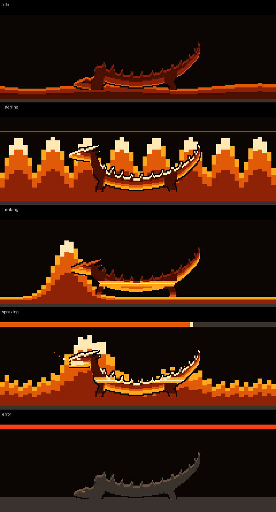
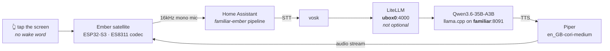

# Ember

A local-first voice assistant satellite whose screen is a hearth.

Ember is an ESPHome device on a cheap 2.8" ESP32-S3 touchscreen, wired to a Home
Assistant Assist pipeline that never leaves the LAN. You tap the screen, speak,
and a dragon lying in the coals answers you. The fire's temperature *is* the
state machine — there is no status text, no spinner, no "listening…" label. When
Ember is thinking, the fire draws up into a column. When it speaks, the flames
chase the words. When the backend is unreachable, the coals go grey and the wyrm
goes to sleep.



*Top to bottom in the file: idle, listening, thinking, speaking, error. The wyrm
is shaded at render time from the live fire palette, so it rides the
ember → amber → gold → white-hot ramp rather than being a baked sprite.
`esphome/art/dragon_in_fire.png` additionally shows the `guttering` and
`daylight` variants.*

---

## The pipeline

Everything runs on the home network. No cloud STT, no cloud LLM, no cloud TTS.



| Stage | What serves it |
|---|---|
| Wake | **Touch.** No wake word — deliberate, see below |
| STT | vosk, on the HA host |
| Conversation agent | Qwen3.6-35B-A3B (UD-Q3_K_XL) under llama.cpp on the `familiar` host, port 8091 — reached **through LiteLLM at `ubox0:4000`** |
| TTS | Piper, voice `en_GB-cori-medium` |

> ⚠️ **LiteLLM in that chain looks like needless indirection and is not.** Home Assistant's
> conversation integration cannot send `chat_template_kwargs`, and Qwen3.6 needs them. Point HA
> straight at `familiar:8091` and it connects fine and *behaves wrongly* — the failure lands in
> the model's **output**, not in the connection, which is about the most expensive place for it
> to land. `chat_model: ember` is a LiteLLM alias, not an upstream model name.

**Why touch and not a wake word.** The mic and speaker share a single I2S hub on
this board and there is no AEC. Continuous wake-word listening on shared
hardware fights the playback path for the same peripheral; tap-to-talk sidesteps
the whole class of problem. It also means Ember cannot be triggered from across
the room by the television.

**Warm replies land in ~1.7s**, but only because the prompt prefix is
byte-stable so llama.cpp can reuse its KV cache (516 tokens re-prefilled instead
of 7,559). Anything volatile early in the prompt costs ~6.5s per turn. This is
measured, not theorised, and it is why `ember_persona.yaml` injects live persona
tweaks at the very *end* of the prompt — see the comment block in that file, it
explains a genuinely counter-intuitive constraint.

> ⚠️ **The prompt-cache fix lives in Home Assistant's `.storage`, not in this
> repo.** The conversation subentry holds the full ~1000-char persona. This
> repo's `ember_persona.yaml` only supplies the 255-char live-tweak field that
> HA's `input_text` helper can express.

---

## Three operating modes

**Normal** (speech + chimes) → **No talking** (chimes only) → **Hush** (silent). Monotonic:
progressively quieter, and nothing else varies. Conversation works fully in all three and the
reply still displays on screen — only what leaves the speaker changes.

The gate is the existing 10 ms audio watchdog declining to lift protection it already asserts,
using the display's own speech predicate — so the thing silenced is exactly what the screen
calls speech, and the two cannot drift apart.

> ⚠️ **Hush changed meaning.** It used to mean *"do not listen to me"* and gated the talk
> gesture; it now means *"do not make noise"*. The microphone is unaffected in every mode. If
> you find a dashboard tile, icon or doc implying otherwise — `mdi:microphone-off` is the tell
> — it is stale, and it was true once. The mode select belongs beside Hush wherever Hush
> appears, because Hush as a view can only reach Normal and Hush, so "No talking" would
> otherwise be unreachable from Home Assistant.

`op_mode` is the value that persists; the select and the Hush switch are lambda views over it,
republished at boot. Before that, a device rebooted while quiet came back genuinely Hush with
the select cheerfully reporting "Normal" — found by power-cycling the real device, not by
reading the config.

---

## The two knobs on the device itself

A short press anywhere raises an overlay carrying **both** audio controls, as a pair that reads
*how loudly it speaks / how well it hears*:

| | Range | Readout |
|---|---|---|
| **Volume** | 0–100% in 5% steps, wrapping at the top | 20 hearth stones, one per 5% |
| **Mic gain** | **0–42 dB in 6 dB steps** | **8** hearth stones |

⚠️ **The 6 dB step is the hardware's, not a taste.** The ES8311's ADC PGA is a 3-bit field in
REG16 with exactly eight legal values — 0/6/12/18/24/30/36/42 dB — so nothing between them is
representable, and a continuous slider would report a setting the codec cannot hold. **The stone
count is the hardware's resolution**, which is why the gain row draws eight where volume draws
twenty: the readout must not imply a precision that does not exist. The first lit stone is 0 dB,
because 0 dB is a real setting and not "off". Exposed to Home Assistant as
`number.ember_satellite_mic_gain`.

Setting it writes REG16 directly *as well as* calling `set_mic_gain()`. The setter only assigns
a member — the driver writes the register once, in its own `setup()` — so calling the setter
alone would change nothing until the next boot, which presents exactly like a control that does
not work.

The same asymmetry bit the *restore* path, and it is worth knowing about if you add another
persisted number here: `TemplateNumber::setup()` calls `publish_state()` and never `control()`,
so a restored value never runs its set action. Set 12 dB, reboot, and HA would read 12 while the
PGA sat at the compile-time 36 — **and the one value immune to the bug was the default, which is
what anyone would test with.** There is now a dedicated `on_boot` trigger that pushes the stored
value back *through* the number, so REG16 keeps a single writer, and it was verified by reading
the register back rather than by inference.

Because that asymmetry has now bitten twice, the agreement is measured rather than assumed: a
60 s check reads REG16 back and publishes `sensor.ember_satellite_mic_gain_codec` (what the chip
holds) and `binary_sensor.ember_satellite_mic_gain_desync` (`problem`, ON when they disagree).
**A failed I²C read leaves both untouched rather than reporting a mismatch it cannot see** — so
"no problem reported" is not the same as "verified in sync". Details in
[`docs/home-assistant.md` §6.6](docs/home-assistant.md#66-hearing-mic-gain-and-the-entity-that-can-call-the-dashboard-a-liar).

Two deliberate trades, both reversals of earlier decisions:

- **The fire is hidden while the overlay is open.** Two controls with touch-sized targets do not
  fit in the scroll band alone, so the overlay grew into the flame band. The targets are 56 px
  ≈ 10.3 mm rather than shrinking below the ~9 mm minimum: five seconds of hidden fire beats a
  target you miss. Mode 1 keeping the fire alive had been a deliberate choice, so this reverses
  a decision rather than filling a gap.
- **The gain buttons are silent where the volume buttons chime.** Volume earns a tone because it
  is the one control that cannot be judged visually — the tone *is* the readout. A tone for mic
  gain plays out of the **speaker** and says nothing about how well the **microphone** hears:
  acknowledgement dressed as measurement. The overlay also stops short of the telemetry band, so
  the live dBFS meter stays visible while you adjust — and a chime would be captured by the very
  mic being read and spike the number.

---

## Hardware

An **LCDWIKI/QDtech ES3C28P**, sold as a "Hosyond 2.8in ESP32-S3 Touchscreen".

| | |
|---|---|
| MCU | ESP32-S3 N16R8 — 16MB flash, 8MB octal PSRAM @ 80MHz |
| Display | 240×320 ILI9341V over SPI, driven by `mipi_spi` at 40MHz |
| Touch | FT6336G capacitive |
| Audio | ES8311 codec — analog differential mic, FM8002E BTL amp to an external speaker |
| Extras | microSD slot, WS2812 |

**The pinout in this repo is traced to the manufacturer's schematic, not copied
from community tables.** Several published tables for this board are wrong. The
YAML carries a comment at every non-obvious choice explaining what it is and why
the obvious value fails — those comments are the real documentation for this
project and should not be stripped.

---

## Settings that look like mistakes (and aren't)

Every row here cost real debugging time. Change one only after reading the
comment at its point of use in the YAML.

| Setting | Why it looks wrong but isn't |
|---|---|
| `i2s_din_pin: 6` / `i2s_dout_pin: 8` | The silkscreen names I2S data pins from the *codec's* perspective, so most published tables are inverted. Confirmed four ways, including the vendor's own shipped source. |
| `use_microphone:` omitted | In ESPHome's es8311 driver that flag enables a *PDM digital* mic. This board's mic is analog-differential into MIC1P/MIC1N. |
| `data_rate: 40MHz` | `mipi_spi`'s base ILI9341 model declares no data rate, so it defaults to **10MHz** — which made full frames take 141ms instead of 60ms. |
| GPIO18 left unconfigured | It's CTP_RST. Both a `reset_pin:` and a gpio `output:` broke touch init — ESPHome's `ft63x6` asserts reset then reads the chip ID with zero delay, ignoring the datasheet's `Trsi >= 300ms`. The FT6336G has a 3k internal pull-up, so leaving it alone is correct. |
| `bits_per_sample: 16bit` on the mic | ESPHome's default is **32bit**, which silently mismatches the 16-bit codec and produces a dead mic. This is the actual bug in the only other published config for this board. |
| `channel: left` | Cosmetic. ES8311 REG 0x44 defaults to "ADC + ADC", duplicating the mono ADC into both slots, and no driver writes that register — so left and right are equivalent here. |
| `auto_clear_enabled: false` | Required by the banded partial redraw. `clear()` would dirty every pixel before the lambda even runs, throwing away the whole optimisation. |
| `buffer_duration: 500ms` | The measured fix for choppy playback — a 16s utterance went 45.8% → 100.7% delivered. **Do not lower it.** Not to be confused with `timeout: 500ms`, which is a different knob entirely. |
| `logger: level: DEBUG` | The i2c bus scan prints at CONFIG level, and in ESPHome's ordering CONFIG is *more* verbose than INFO — so `level: INFO` silently hides the scan results. |

Deeper write-ups live alongside this table:

- **[docs/audio-pop.md](docs/audio-pop.md)** — the audible pop on audio start, and
  **how it was resolved.** Read the coda if you touch the audio path. The headline:
  for three rounds the protection sat *behind* the transient it was meant to cover,
  so every A/B test was measuring a knob that fired after the event. The file has
  now been wrong in three distinguishable ways and each error was caught by a
  different method — that chain is deliberately preserved rather than replaced with
  the conclusion. Includes one **accepted** hazard whose symptom is a clipped first
  syllable, not a pop, and which would therefore be blamed on TTS.
- **[docs/enclosure.md](docs/enclosure.md)** — verified board geometry off the vendor
  drawing, the official STEP model, and why **no printable case existed for this board
  anywhere** before this one. The constraint that catches everyone: the touch glass is the
  full 50 mm PCB width, so you cannot clamp the long edges.
- **The YAML's own header** — four architecture notes on why there is no LVGL,
  how the banded partial redraw works, and why the fire renders row-major.
  `>>> Do not "simplify" the fire back into per-column filled_rectangle calls.
  It looks identical and costs several times more. <<<`

### Calibration knobs

These are guesses until measured on *your* hardware, and are marked in-file:

| Knob | What to do |
|---|---|
| `db_floor` / `db_ceil` | Speak normally ~40cm away, watch `sensor.mic_rms`, set floor just under room noise and ceiling just over speech. Too narrow and the meter pins; too wide and it looks dead. |
| `tts_ms_per_char` | Tunes the speaking animation's guess at utterance length. |
| `cpl_body` / `cpl_sm` | Characters-per-line for the two text sizes. |

---

## Chimes

`esphome/sounds/` holds eight 16kHz mono tones plus `generate_chimes.py`, which
produced them. Struck-glass synthesis — inharmonic partials, exponential decay,
4ms raised-cosine attack, warm F-pentatonic so any two are consonant. `error` is
the one deliberate dissonance.

16kHz is not a compromise: the highest partial is 6.79× the fundamental and the
highest fundamental is C5 (523.25Hz) → 3552Hz, comfortably under the 8kHz
Nyquist. Rendering at 44.1kHz and letting the device resample would be strictly
worse — it would put a resampler in an audio path that is deliberately a
straight line.

Regenerate with `python3 esphome/sounds/generate_chimes.py`.

> **`chime_listening` is generated but deliberately never declared.** 1.4s of
> tone out of a speaker sharing one I2S hub with the mic, with no AEC, would
> make HA's VAD end the utterance before you finished speaking. The symptom
> would read as an STT bug and send you looking in entirely the wrong place.
> Don't wire it. The reasoning is repeated at the point of use in the YAML.

---

## The hearth-wyrm

`esphome/art/dragon.py` generates the dragon. It is **not** an ESPHome `image:` —
it emits per-row run-length **spans** as C tables, because:

- The flame band renders row-major and must tile every row exactly once
  (`auto_clear_enabled: false`). An `it.image()` blit would be a second write
  over pixels the fire already wrote; spans composite into the existing
  run-length classifier and preserve write-once.
- Spans carry no colour, so the wyrm is shaded at render time from the live
  fire-temperature palette. It rides the heat ramp, honours the daylight theme,
  and brightens with state. A baked image cannot do any of that.
- The animation is procedural — head lift, glow, travelling rim light — so it
  never visibly loops the way frame-cycled art does.

Deterministic, no RNG. Regenerate with `python3 esphome/art/dragon.py`, which
rewrites `dragon_spans.inc` (pasted into the display lambda) and the preview
PNGs.

### Falsifying a flame-band change before you flash it

`esphome/art/dragon_harness.cpp` compiles the `paint_flame` body against stubs and
checks the two things no compiler can: that every row of the band is written **exactly
once**, and that nothing writes outside `y188..263`. It also reports **runs/frame** and
**px/frame** per assistant state and dumps `wyrm_<state>.ppm` so a change can be looked
at rather than reasoned about.

```bash
g++ -std=gnu++20 -O2 -Wall -Wextra -o /tmp/dh esphome/art/dragon_harness.cpp && /tmp/dh
```

Two things to know before trusting a pass, both explained at length in the file's
header. `FAIL negative-control: …covered 0 times` **is expected** — it is the harness
proving its own tiling check can fail. And the tiling check **cannot** catch an over-tall
`MAXH`: the fuse rows are painted before the fire logic, so a too-tall flame is silently
clipped flat while every pixel remains covered exactly once. If you touch `GRATE` or
`MAXH`, look at the PPM.

It mirrors the lambda in `ember-satellite.yaml`. Change one, change the other — it is
only worth running while it is the same code.

---

## The enclosure

**There was no printable case for this board.** Not under `ES3C28P`, not under any reseller
alias, not on any model site — because the ES3C28P vents its microphone through the *front*
face, and every CYD-derived shell that physically fits has no port there. For a voice
satellite that is decisive, and it is not a cutout you can add to somebody else's STL from
the outside.

So there is one now. **Four parts, none needing supports**, in [`enclosure/`](enclosure/):

> ⛔ **`ember-stand-base.stl` does not seat.** It is **1.40 mm too deep** in the committed
> geometry — the plate carried a hardcoded copy of the chamber's rear wall (20.7) while that
> wall was later derived and moved to 19.30, and the literal did not follow. **The sealed
> speaker chamber cannot be closed with it.** The part is 3.15 cm³ so the print is cheap; the
> assembly is the problem. A fix is in progress. **Nothing in the build could have caught this**
> — every clearance check compares a part to *the board*, and this plate never goes near the
> board. See [`enclosure/PRINT-SHEET.md`](enclosure/PRINT-SHEET.md).
>
> ✅ **The other three are ready for a bed.** `ember-stand.stl` was held back — the speaker-wire pass
> into the sealed chamber was blocked by a 0.50 mm skin of the tape pad, leaving a 0.40 mm slit
> where a 1.2–2.0 mm lead has to pass. Fixed in `338a900`: the clear aperture is now **28.69 mm²
> of 30 (95.6 %), up from 2.37 (7.9 %)**, and the stand has no feature below 0.60 mm. Two other
> slivers went with it — see [`enclosure/PRINT-SHEET.md`](enclosure/PRINT-SHEET.md).
> `ember-front-bezel.stl` has been printed and its dimensions look right; it is byte-identical
> across the fix. Nothing has been assembled yet.

| | |
|---|---|
| `ember-front-bezel.stl` | front face down. Carries the ⌀2.40 mm mic port, the screen window, a debossed honeycomb and the hearth-wyrm |
| `ember-back-shell.stl` | back face down. Two printed-in-place hexagonal button pads on living hinges, 15.00 and 10.00 mm across the flats |
| `ember-stand.stl` | bottom face down. A 15° cradle that **is** the speaker cabinet, with finger scallops reaching the buttons |
| `ember-stand-base.stl` | flat. Closes the chamber |

**`ember_case.py` is the artifact; the STLs are output** — regenerate them, don't hand-edit
them. It is build123d on OpenCASCADE, which is the point: the vendor's STEP model can be
*imported* and every part checked against it by boolean subtraction, so every board dimension
is measured rather than transcribed from a datasheet table.

```bash
cd enclosure
python3 -m venv cadenv && ./cadenv/bin/pip install -r tools/requirements.txt
./cadenv/bin/python ember_case.py            # STLs + clearance check + geometry asserts
./cadenv/bin/python tools/make_renders.py    # the site figures
```

- **[`enclosure/README.md`](enclosure/README.md)** — building from a fresh clone, what the two
  kinds of check actually do, and the parameters most likely to need a second print.
- **[`enclosure/PRINT-SHEET.md`](enclosure/PRINT-SHEET.md)** — orientations, slicer settings,
  fasteners, assembly order. Also served as a page at
  [`docs/print-sheet.html`](docs/print-sheet.html), because that is the one document you read
  while a printer is running.

> **The two lessons this part of the project keeps teaching.** *A test that cannot fail is not
> a test* — the clearance checker returned a confident `CLEAR` for a while because the vendor
> solid and the parts were in disjoint coordinate frames, so every boolean returned empty.
> There is now a permanent self-test that deliberately sinks a bezel into the board and must
> report **1467.842 mm³**. And *a boolean cannot see occlusion* — the stand covered a fifth of
> the screen, then buried both buttons, without ever intersecting anything. Both were found by
> rendering the thing and looking at it.
>
> The first lesson landed a second time, on the mesh check. The repo asserted *"all parts
> watertight, 0 non-manifold edges"* on a check that imported each STL with build123d and
> counted boundary edges — and `import_stl` returns a single `Face` with **zero edges and zero
> volume**, so the count was zero because there was nothing to count. The true figures, printed
> on every build: **three parts watertight; `ember-front-bezel` carries 3 non-manifold edges**
> in a valid solid with zero boundary edges, a coplanar-seam artefact from the wyrm mark's
> stacked row-spans that slicers repair. It is recorded as a number rather than a threshold, and
> raising it to make a build pass is explicitly forbidden.

---

## Repository layout

```
esphome/
  ember-satellite.yaml       the device. ~3700 lines, and the comments are the docs
  secrets.yaml.example       copy to secrets.yaml — three keys, never committed
  sounds/                    8 chime WAVs + generate_chimes.py
  art/                       dragon.py, dragon_spans.inc, preview PNGs
                             dragon_harness.cpp — host falsifier for the flame band
homeassistant/
  packages/
    ember_backend_health.yaml  is the local LLM actually reachable?
    ember_persona.yaml         live persona tweak field, editable from HA
    ember_announce.yaml        script.ember_announce — the right herald
  dashboards/
    ember-hearth.dashboard.json  the Ember control panel (lovelace)
  tools/
    build_ember_dashboard.py     authoritative regen path for the dashboard
    deploy-ha.sh                 push packages to the HA VM + reload
enclosure/
  ember_case.py                THE ARTIFACT — build123d; the STLs are its output
  ember-*.stl                  four printable parts, regenerated not hand-edited
  PRINT-SHEET.md               orientations, slicer settings, assembly order
  README.md                    building from a fresh clone; what the checks do
  tools/make_renders.py        the site figures -> site/renders/
  cadenv/                      the whole CAD toolchain, gitignored AND stignored
site/                        SOURCES for the project site
  index.src.html               hand-edit this
  build.py                     -> docs/, inlining art and copying chimes
  build_print_sheet.py         enclosure/PRINT-SHEET.md -> docs/print-sheet.html
  renders/                     enclosure figures, GENERATED by make_renders.py
  ember-art-web/og_card.py     regenerates the social preview card, and refuses
                               to ship a known-wrong engine name
docs/                        the GitHub Pages root
  index.html                   GENERATED by site/build.py; do NOT hand-edit
  print-sheet.html             GENERATED from enclosure/PRINT-SHEET.md
  assets/                      chimes + og card
  home-assistant.md            the full HA-side guide
  audio-pop.md                 the pop analysis + how it was resolved
  enclosure.md                 board geometry, and the case survey that found none
  verification.md              the running log of claims that outran their evidence
  version.json                 realm-sigil stamp
```

> `docs/index.html` is **generated**. Edit `site/index.src.html` and re-run
> `python3 site/build.py`. Hand edits to `docs/index.html` are destroyed silently by
> the next build.
>
> `./build-sigil.sh` writes only `docs/version.json` and touches nothing else, so the
> two commands write disjoint files and can be run in either order. See
> [docs/README.md](docs/README.md) for why that wasn't always true.

---

## Build and flash

Requires ESPHome. The config declares `min_version: 2025.11.0` and is verified
against **2026.7.2**.

```bash
cd esphome
cp secrets.yaml.example secrets.yaml   # then fill in the three keys
esphome compile ember-satellite.yaml
esphome upload  ember-satellite.yaml --device ember-satellite.local   # OTA
esphome logs    ember-satellite.yaml --device ember-satellite.local
```

> ⚠️ **`esphome config` is not a build check.** It validates YAML — schema, pins,
> substitutions, jinja — and **never builds the lambdas**. A config with unambiguous
> C++ errors in them returns `Configuration is valid!` and exit 0. Worse, the dump
> **echoes the broken lambda source back at you verbatim**, so it prints the C++ and
> then declares the configuration valid, which reads as though it examined what it
> printed. It round-tripped it as an opaque string. **Use `esphome compile`** — no
> device needed, and it is the step that builds the C++.
>
> ⚠️ **`esphome upload` does NOT compile either.** It ships whatever is already in
> `.esphome/build/`, silently. Always `esphome compile` first, or use `esphome
> run` which does both. Two debugging rounds were lost to flashing a stale
> binary whose symptoms reproduced to the millisecond.
>
> **These two are neighbours and fail the same way**: each is a step you would
> reasonably read as "check it before flashing", and neither compiles anything. Between
> them, a C++ error can survive a validation *and* a flash and first appear as a device
> that does not boot.

Compiling on a workstation is roughly 5× faster than building on the HA host.

First flash has to be over USB (`--device /dev/ttyACM0`); everything after that
can be OTA.

### Verifying the banded redraw

The one test that matters after touching the display code. The YAML's `logger:`
block carries the exact swap to make — it turns on the per-band frame accounting
so you can confirm at most one band repaints per frame.

---

## Home Assistant side

**[docs/home-assistant.md](docs/home-assistant.md) is the full guide** —
prerequisites, deploy, verification, the pipeline internals, and troubleshooting
ordered by how much time each fault costs you. Read it before a fresh install;
roughly half of Ember's HA-side configuration is *not* expressible as a repo file
(add-ons, the conversation agent entry, the Assist pipeline) and that document
enumerates every manual step.

The files under `homeassistant/` are the version-controlled source for config that
lives on the HA host. **This repo is the source of truth**; `deploy-ha.sh` copies
packages to the VM and reloads only the domains that changed:

```bash
homeassistant/tools/deploy-ha.sh --check     # validate only, no SSH needed
homeassistant/tools/deploy-ha.sh --dry-run   # show what would change
homeassistant/tools/deploy-ha.sh             # deploy all three + reload
```

> ⚠️ **The API host and the SSH host are different machines.** The public name
> resolves to the reverse proxy, not the HA VM. SSH there succeeds, `sudo tee`
> writes the packages onto the *proxy*, reports success, and changes nothing in
> Home Assistant. `deploy-ha.sh` keeps the two names separate deliberately and says
> why in a comment — don't "tidy" it. Override with `HA_SSH_HOST` and `HA_API`.

- **`packages/*.yaml`** → drop into your HA `packages/` directory. Reloadable
  without a full restart via `rest.reload` / `script.reload` where applicable.
- **`dashboards/ember-hearth.dashboard.json`** → pushed by
  `tools/build_ember_dashboard.py`, which creates the top-level dashboard if
  absent and then saves the config over the WebSocket API. **The repo is the
  source of truth**; a regen deliberately clobbers UI edits, which is the point.

```bash
export HA_WS="wss://ha.example.com/api/websocket"   # only if the default is wrong for you
python3 homeassistant/tools/build_ember_dashboard.py --dry   # print, touch nothing
python3 homeassistant/tools/build_ember_dashboard.py         # create + save
```

> ⚠️ **`HA_WS` wants the name on the TLS certificate — usually your edge/proxy host, and
> usually with no port.** This example used to read `wss://your-ho…:8123/api/websocket`, and
> that shape fails three ways in a row, each masking the next: `homeassistant.local` often
> does not resolve at all; the LAN name may resolve but serve **HTTPS** on 8123, so plain
> `ws://` reports *"did not receive a valid HTTP response"* — which reads as a protocol fault
> when it is a scheme mismatch; and `wss://<lan-name>:8123` then fails certificate
> verification, because the cert is issued for the public name. The default in the script is
> the edge name for exactly this reason, and it is a hostname, never an IP.
>
> This is also **not** the SSH host. `deploy-ha.sh` copies files to the VM; this script talks
> to the API through the proxy. They are different machines and each tool already uses the
> right one.

Auth resolves in order: `HA_TOKEN` env var → `~/.cache/ha-token-tmp` → a
password-manager lookup. The script needs `websockets` (`pip install websockets`).

Notes that will bite otherwise:

- HA requires a custom dashboard `url_path` to contain a hyphen. Hence
  `ember-hearth`.
- Hand-edit the JSON, and keep `indent=1, ensure_ascii=True` if you ever rewrite
  it programmatically. Any other setting re-encodes every non-ASCII glyph and
  buries a one-tile change in a 300-line diff. This file is ~40% ember-ramp
  glyphs, so it matters more here than usual.
- Card inventory is 100% HA-core card types. The only non-core dependency is
  **card-mod** for the ember palette, and it only injects CSS — if it fails to
  load the cards still render, just unstyled.
- The pipeline → agent/stt/tts/voice tables inside the markdown cards are a
  snapshot taken 2026-07-29. Refresh them if you add or rename pipelines.
- Address the backend host **by hostname**. `familiar.lan` from the HA VM (HAOS
  does not resolve the bare name), `familiar` from a workstation. Never the IP:
  it moved once and the stale literal cost a debugging session.
- Polling the backend does **not** keep it awake, and does not wake it either.
  The host's autosuspend decides on whether the inference lane is loaded, not on
  network traffic. So a failed poll is a true signal, not an artefact of
  measuring.

### Announcements

Always go through `script.ember_announce`, never `assist_satellite.announce`
directly. The raw service sends a `preannounce_media_id` unless told not to, and
Ember *also* plays its own local chime when an announcement arrives — so the
default gives you HA's generic blip followed by Ember's chime, back to back,
which sounds exactly like a firmware bug. `preannounce: false` is not optional,
and the script exists so no future automation has to remember that.

---

## Versioning

The project site carries a [realm-sigil](https://github.com/jphein/realm-sigil)
version stamp — `docs/version.json` plus a `<meta name="realm-version">` tag in
the page, generated from the git hash by `build-sigil.sh`.

The firmware itself is versioned by ESPHome and reported to Home Assistant as the
device's own version. It has no HTTP surface, so it has no `/api/version`
endpoint and does not need one.

---

## Provenance

Ember started life inside a Home Assistant configuration repo and was extracted
into this one with `git filter-repo`, preserving **every** commit that touched it —
`git log -- esphome/ember-satellite.yaml` is the real answer, and it goes back to
the file's first appearance.

Those commit messages are load-bearing. Several are the only record of *why* a
non-obvious setting is what it is, and more than one documents a conclusion that a
later commit overturned. `git log --follow` works across the extraction, including
through `esphome/README.md` → `README.md`.

Read them in order if you are about to change the touch or audio paths. The last
four in particular are a chain of corrections, each one fixing a bug the previous
fix revealed — a debounce that re-armed and cancelled deliberate presses, a
completion chime that destroyed the reply it was announcing, a 250ms timeout
measured off a single fast sample. The final shape (dispatch on release, never
preempt audio that is playing) only makes sense against that history.
