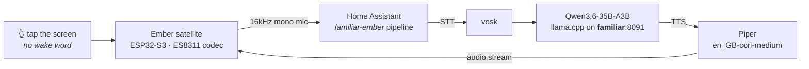

# Ember

A local-first voice assistant satellite whose screen is a hearth.

Ember is an ESPHome device on a cheap 2.8" ESP32-S3 touchscreen, wired to a Home
Assistant Assist pipeline that never leaves the LAN. You tap the screen, speak,
and a dragon lying in the coals answers you. The fire's temperature *is* the
state machine — there is no status text, no spinner, no "listening…" label. When
Ember is thinking, the fire draws up into a column. When it speaks, the flames
chase the words. When the backend is unreachable, the coals go grey and the wyrm
goes to sleep.


*Top to bottom in the file: idle, listening, thinking, speaking, error. The wyrm
is shaded at render time from the live fire palette, so it rides the
ember → amber → gold → white-hot ramp rather than being a baked sprite.
`esphome/art/dragon_in_fire.png` additionally shows the `guttering` and
`daylight` variants.*

---

## The pipeline

Everything runs on the home network. No cloud STT, no cloud LLM, no cloud TTS.



| Stage | What serves it |
|---|---|
| Wake | **Touch.** No wake word — deliberate, see below |
| STT | vosk, on the HA host |
| Conversation agent | Qwen3.6-35B-A3B (UD-Q3_K_XL) under llama.cpp on the `familiar` host, port 8091 |
| TTS | Piper, voice `en_GB-cori-medium` |

**Why touch and not a wake word.** The mic and speaker share a single I2S hub on
this board and there is no AEC. Continuous wake-word listening on shared
hardware fights the playback path for the same peripheral; tap-to-talk sidesteps
the whole class of problem. It also means Ember cannot be triggered from across
the room by the television.

**Warm replies land in ~1.7s**, but only because the prompt prefix is
byte-stable so llama.cpp can reuse its KV cache (516 tokens re-prefilled instead
of 7,559). Anything volatile early in the prompt costs ~6.5s per turn. This is
measured, not theorised, and it is why `ember_persona.yaml` injects live persona
tweaks at the very *end* of the prompt — see the comment block in that file, it
explains a genuinely counter-intuitive constraint.

> ⚠️ **The prompt-cache fix lives in Home Assistant's `.storage`, not in this
> repo.** The conversation subentry holds the full ~1000-char persona. This
> repo's `ember_persona.yaml` only supplies the 255-char live-tweak field that
> HA's `input_text` helper can express.

---

## Hardware

An **LCDWIKI/QDtech ES3C28P**, sold as a "Hosyond 2.8in ESP32-S3 Touchscreen".

| | |
|---|---|
| MCU | ESP32-S3 N16R8 — 16MB flash, 8MB octal PSRAM @ 80MHz |
| Display | 240×320 ILI9341V over SPI, driven by `mipi_spi` at 40MHz |
| Touch | FT6336G capacitive |
| Audio | ES8311 codec — analog differential mic, FM8002E BTL amp to an external speaker |
| Extras | microSD slot, WS2812 |

**The pinout in this repo is traced to the manufacturer's schematic, not copied
from community tables.** Several published tables for this board are wrong. The
YAML carries a comment at every non-obvious choice explaining what it is and why
the obvious value fails — those comments are the real documentation for this
project and should not be stripped.

---

## Settings that look like mistakes (and aren't)

Every row here cost real debugging time. Change one only after reading the
comment at its point of use in the YAML.

| Setting | Why it looks wrong but isn't |
|---|---|
| `i2s_din_pin: 6` / `i2s_dout_pin: 8` | The silkscreen names I2S data pins from the *codec's* perspective, so most published tables are inverted. Confirmed four ways, including the vendor's own shipped source. |
| `use_microphone:` omitted | In ESPHome's es8311 driver that flag enables a *PDM digital* mic. This board's mic is analog-differential into MIC1P/MIC1N. |
| `data_rate: 40MHz` | `mipi_spi`'s base ILI9341 model declares no data rate, so it defaults to **10MHz** — which made full frames take 141ms instead of 60ms. |
| GPIO18 left unconfigured | It's CTP_RST. Both a `reset_pin:` and a gpio `output:` broke touch init — ESPHome's `ft63x6` asserts reset then reads the chip ID with zero delay, ignoring the datasheet's `Trsi >= 300ms`. The FT6336G has a 3k internal pull-up, so leaving it alone is correct. |
| `bits_per_sample: 16bit` on the mic | ESPHome's default is **32bit**, which silently mismatches the 16-bit codec and produces a dead mic. This is the actual bug in the only other published config for this board. |
| `channel: left` | Cosmetic. ES8311 REG 0x44 defaults to "ADC + ADC", duplicating the mono ADC into both slots, and no driver writes that register — so left and right are equivalent here. |
| `auto_clear_enabled: false` | Required by the banded partial redraw. `clear()` would dirty every pixel before the lambda even runs, throwing away the whole optimisation. |
| `buffer_duration: 500ms` | The measured fix for choppy playback — a 16s utterance went 45.8% → 100.7% delivered. **Do not lower it.** Not to be confused with `timeout: 500ms`, which is a different knob entirely. |
| `logger: level: DEBUG` | The i2c bus scan prints at CONFIG level, and in ESPHome's ordering CONFIG is *more* verbose than INFO — so `level: INFO` silently hides the scan results. |

Two deeper write-ups live alongside this table:

- **[docs/audio-pop.md](docs/audio-pop.md)** — the audible pop on audio start.
  Partly fixed, root cause still ambiguous between an analog and a digital
  mechanism, with the one experiment that would settle it (it needs no reflash).
  Also documents two earlier claims that were wrong in opposite directions.
- **The YAML's own header** — four architecture notes on why there is no LVGL,
  how the banded partial redraw works, and why the fire renders row-major.
  `>>> Do not "simplify" the fire back into per-column filled_rectangle calls.
  It looks identical and costs several times more. <<<`

### Calibration knobs

These are guesses until measured on *your* hardware, and are marked in-file:

| Knob | What to do |
|---|---|
| `db_floor` / `db_ceil` | Speak normally ~40cm away, watch `sensor.mic_rms`, set floor just under room noise and ceiling just over speech. Too narrow and the meter pins; too wide and it looks dead. |
| `tts_ms_per_char` | Tunes the speaking animation's guess at utterance length. |
| `cpl_body` / `cpl_sm` | Characters-per-line for the two text sizes. |

---

## Chimes

`esphome/sounds/` holds eight 16kHz mono tones plus `generate_chimes.py`, which
produced them. Struck-glass synthesis — inharmonic partials, exponential decay,
4ms raised-cosine attack, warm F-pentatonic so any two are consonant. `error` is
the one deliberate dissonance.

16kHz is not a compromise: the highest partial is 6.79× the fundamental and the
highest fundamental is C5 (523.25Hz) → 3552Hz, comfortably under the 8kHz
Nyquist. Rendering at 44.1kHz and letting the device resample would be strictly
worse — it would put a resampler in an audio path that is deliberately a
straight line.

Regenerate with `python3 esphome/sounds/generate_chimes.py`.

> **`chime_listening` is generated but deliberately never declared.** 1.4s of
> tone out of a speaker sharing one I2S hub with the mic, with no AEC, would
> make HA's VAD end the utterance before you finished speaking. The symptom
> would read as an STT bug and send you looking in entirely the wrong place.
> Don't wire it. The reasoning is repeated at the point of use in the YAML.

---

## The hearth-wyrm

`esphome/art/dragon.py` generates the dragon. It is **not** an ESPHome `image:` —
it emits per-row run-length **spans** as C tables, because:

- The flame band renders row-major and must tile every row exactly once
  (`auto_clear_enabled: false`). An `it.image()` blit would be a second write
  over pixels the fire already wrote; spans composite into the existing
  run-length classifier and preserve write-once.
- Spans carry no colour, so the wyrm is shaded at render time from the live
  fire-temperature palette. It rides the heat ramp, honours the daylight theme,
  and brightens with state. A baked image cannot do any of that.
- The animation is procedural — head lift, glow, travelling rim light — so it
  never visibly loops the way frame-cycled art does.

Deterministic, no RNG. Regenerate with `python3 esphome/art/dragon.py`, which
rewrites `dragon_spans.inc` (pasted into the display lambda) and the preview
PNGs.

---

## Repository layout

```
esphome/
  ember-satellite.yaml       the device. ~3700 lines, and the comments are the docs
  secrets.yaml.example       copy to secrets.yaml — three keys, never committed
  sounds/                    8 chime WAVs + generate_chimes.py
  art/                       dragon.py, dragon_spans.inc, preview PNGs
homeassistant/
  packages/
    ember_backend_health.yaml  is the local LLM actually reachable?
    ember_persona.yaml         live persona tweak field, editable from HA
    ember_announce.yaml        script.ember_announce — the right herald
  dashboards/
    ember-hearth.dashboard.json  the Ember control panel (lovelace)
  tools/
    build_ember_dashboard.py     authoritative regen path for the dashboard
docs/
  audio-pop.md               the pop analysis
  index.html                 project site (GitHub Pages root)
```

---

## Build and flash

Requires ESPHome. The config declares `min_version: 2025.11.0` and is verified
against **2026.7.2**.

```bash
cd esphome
cp secrets.yaml.example secrets.yaml   # then fill in the three keys
esphome compile ember-satellite.yaml
esphome upload  ember-satellite.yaml --device ember-satellite.local   # OTA
esphome logs    ember-satellite.yaml --device ember-satellite.local
```

> ⚠️ **`esphome upload` does NOT compile.** It ships whatever is already in
> `.esphome/build/`, silently. Always `esphome compile` first, or use `esphome
> run` which does both. Two debugging rounds were lost to flashing a stale
> binary whose symptoms reproduced to the millisecond.

Compiling on a workstation is roughly 5× faster than building on the HA host.

First flash has to be over USB (`--device /dev/ttyACM0`); everything after that
can be OTA.

### Verifying the banded redraw

The one test that matters after touching the display code. The YAML's `logger:`
block carries the exact swap to make — it turns on the per-band frame accounting
so you can confirm at most one band repaints per frame.

---

## Home Assistant side

The files under `homeassistant/` are not auto-deployed; they are the
version-controlled source for config that lives on the HA host.

- **`packages/*.yaml`** → drop into your HA `packages/` directory. Reloadable
  without a full restart via `rest.reload` / `script.reload` where applicable.
- **`dashboards/ember-hearth.dashboard.json`** → pushed by
  `tools/build_ember_dashboard.py`, which creates the top-level dashboard if
  absent and then saves the config over the WebSocket API. **The repo is the
  source of truth**; a regen deliberately clobbers UI edits, which is the point.

```bash
export HA_WS="wss://your-ha-host:8123/api/websocket"
python3 homeassistant/tools/build_ember_dashboard.py --dry   # print, touch nothing
python3 homeassistant/tools/build_ember_dashboard.py         # create + save
```

Auth resolves in order: `HA_TOKEN` env var → `~/.cache/ha-token-tmp` → a
password-manager lookup. The script needs `websockets` (`pip install websockets`).

Notes that will bite otherwise:

- HA requires a custom dashboard `url_path` to contain a hyphen. Hence
  `ember-hearth`.
- Hand-edit the JSON, and keep `indent=1, ensure_ascii=True` if you ever rewrite
  it programmatically. Any other setting re-encodes every non-ASCII glyph and
  buries a one-tile change in a 300-line diff. This file is ~40% ember-ramp
  glyphs, so it matters more here than usual.
- Card inventory is 100% HA-core card types. The only non-core dependency is
  **card-mod** for the ember palette, and it only injects CSS — if it fails to
  load the cards still render, just unstyled.
- The pipeline → agent/stt/tts/voice tables inside the markdown cards are a
  snapshot taken 2026-07-29. Refresh them if you add or rename pipelines.
- Address the backend host **by hostname**. `familiar.lan` from the HA VM (HAOS
  does not resolve the bare name), `familiar` from a workstation. Never the IP:
  it moved once and the stale literal cost a debugging session.
- Polling the backend does **not** keep it awake, and does not wake it either.
  The host's autosuspend decides on whether the inference lane is loaded, not on
  network traffic. So a failed poll is a true signal, not an artefact of
  measuring.

### Announcements

Always go through `script.ember_announce`, never `assist_satellite.announce`
directly. The raw service sends a `preannounce_media_id` unless told not to, and
Ember *also* plays its own local chime when an announcement arrives — so the
default gives you HA's generic blip followed by Ember's chime, back to back,
which sounds exactly like a firmware bug. `preannounce: false` is not optional,
and the script exists so no future automation has to remember that.

---

## Versioning

The project site carries a [realm-sigil](https://github.com/jphein/realm-sigil)
version stamp — `docs/version.json` plus a `<meta name="realm-version">` tag in
the page, generated from the git hash by `build-sigil.sh`.

The firmware itself is versioned by ESPHome and reported to Home Assistant as the
device's own version. It has no HTTP surface, so it has no `/api/version`
endpoint and does not need one.

---

## Provenance

Ember started life inside a Home Assistant configuration repo and was extracted
into this one with `git filter-repo`, preserving all 15 commits that touched it.
Those commit messages are load-bearing — several are the only record of *why* a
non-obvious setting is what it is, and more than one documents a conclusion that a
later commit overturned. `git log --follow` works across the extraction, including
through `esphome/README.md` → `README.md`.

Read them in order if you are about to change the touch or audio paths. The last
four in particular are a chain of corrections, each one fixing a bug the previous
fix revealed — a debounce that re-armed and cancelled deliberate presses, a
completion chime that destroyed the reply it was announcing, a 250ms timeout
measured off a single fast sample. The final shape (dispatch on release, never
preempt audio that is playing) only makes sense against that history.
